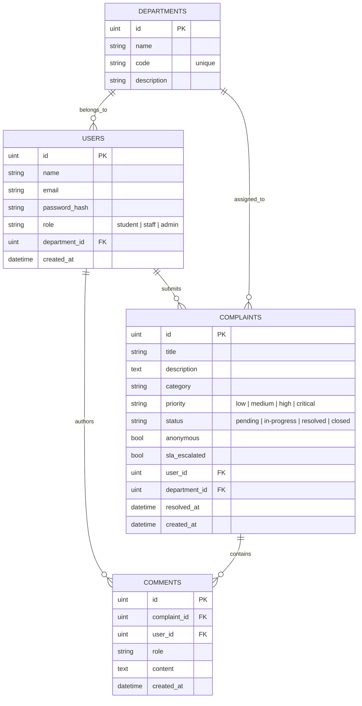
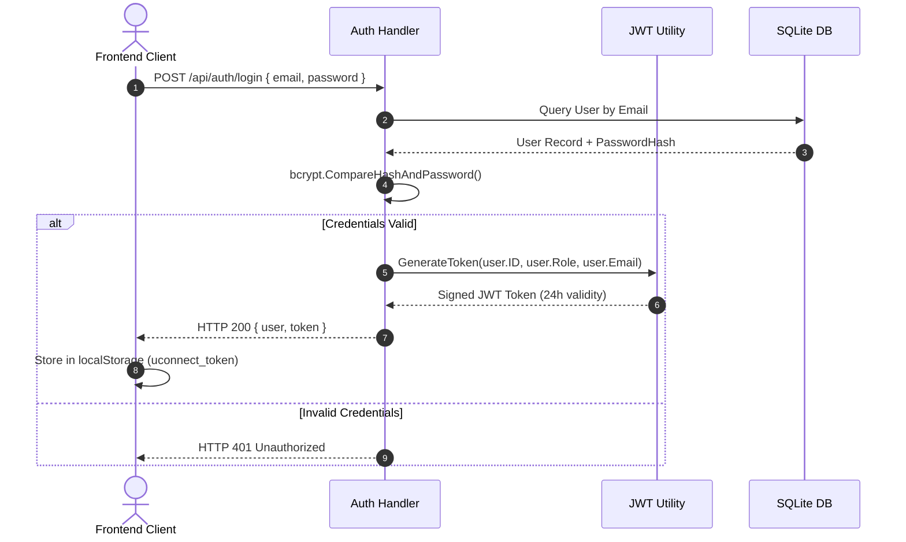

# U-Connect System Architecture & Engineering Specifications

This document outlines the architectural patterns, business rule implementations, security boundaries, and data flow models powering **U-Connect**.

---

## 1. Domain Entities & Database Schema

The database layer utilizes SQLite configured with single-connection concurrency (`SetMaxOpenConns(1)`) to avoid locking conditions under write loads.



---

## 2. Business Rules & State Machine Specifications

### Rule 1: Priority Auto-Escalation
When a student submits a grievance:
- The system inspects the lowercase `description` for any of the emergency keywords:
  `["emergency", "urgent", "critical", "immediate", "danger"]`.
  If matched &rarr; Priority is set to **`critical`**.
- Else if the `category` is **`Exam Hall`** or **`Safety`** &rarr; Priority is set to **`high`**.
- Otherwise &rarr; Priority is assigned **`medium`**.

### Rule 2: Strict Transition State Machine
Grievance lifecycles are strictly governed by transition guards:

```
        ┌──────────────────────────────────────────────┐
        │                                              ▼
    [pending] ──────► [in-progress] ──────► [resolved] ────► [closed] (Terminal)
        │                     │                                  ▲
        └─────────────────────┴──────────────────────────────────┘
```

- `pending` &rarr; may transition to `in-progress`, `resolved`, or `closed`.
- `in-progress` &rarr; may transition to `resolved`, `closed`, or back to `pending`.
- `resolved` &rarr; may only transition to `closed`.
- `closed` &rarr; **Terminal state**. Once closed, no further transitions or edits are allowed.

### Rule 3: SLA Breach Monitoring
- Target SLA window: **72 hours** (`time.Since(CreatedAt) > 72 * time.Hour`).
- If a complaint remains in `pending` status past 72 hours, it is flagged as an active SLA breach.
- Batch escalation automatically tags `sla_escalated = true`.

### Rule 4: Anonymous Student Masking
- If `anonymous == true`:
  - When responding to **Staff** or **Student** queries, the `User` object is stripped and `UserID` set to `0`.
  - When accessed by an **Administrator**, the identity remains visible for institutional safety and compliance.

### Rule 5: Role-Based Data Access (RBAC)
- **Students**: Scoped to view only their own complaints. Cannot alter status.
- **Staff**: Can view complaints assigned across departments, update status, and add comments.
- **Admin**: Unrestricted institutional visibility, user role assignments, department CRUD, and CSV exports.

---

## 3. Authentication & Security Flow



---

## 4. Subsystem Responsibilities (For 5-Person Team)

1. **Backend Service Layer (`/backend/internal/services/`)**:
   - `auth_service.go`: Registration, authentication, user listing, role upgrades.
   - `complaint_service.go`: Intake validation, auto-escalation evaluation, state machine validation, CSV formatting.
   - `dashboard_service.go`: Aggregated statistics, SLA breach counts, average resolution duration computation.
2. **Frontend Service Layer (`/frontend/src/services/`)**:
   - `apiClient.ts`: Base fetch wrapper with Bearer token injection and error parsing.
   - `complaint.service.ts`: Grievance fetching, filtering, creation, status transitions, and CSV blob downloading.
   - `department.service.ts` & `admin.service.ts`: Administrative management.
